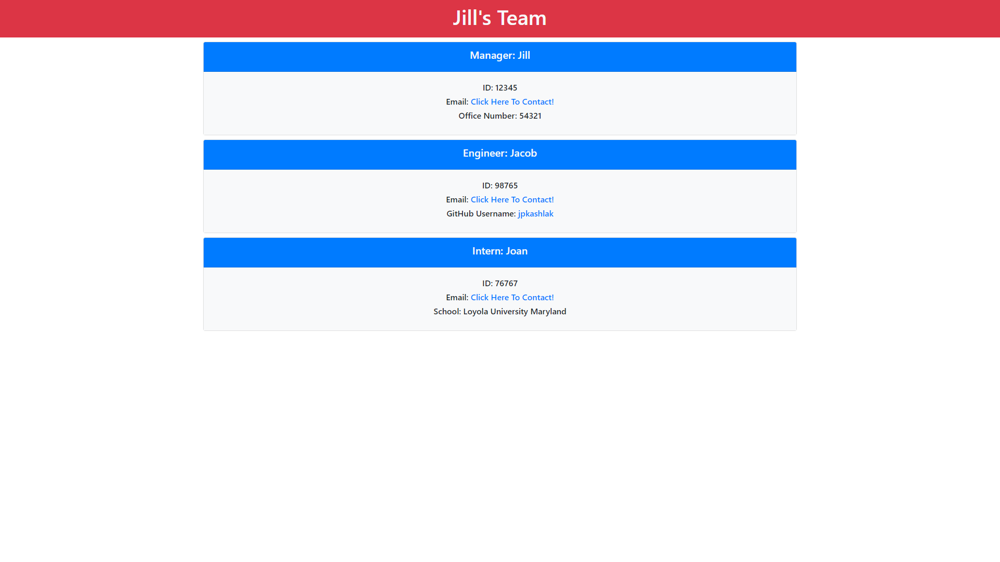
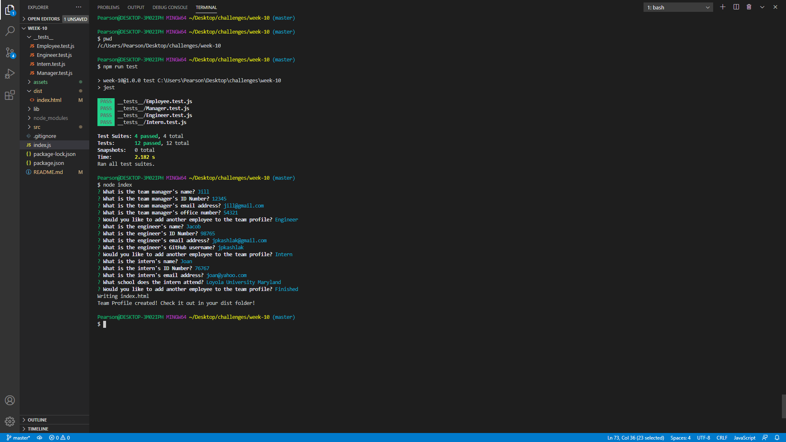

# Team Profile Generator

## Table of Contents
* [Description](#description)
* [Intallation](#installation)
* [Usage](#usage)
* [Tests](#tests)
* [Screenshots](#screenshots)
* [Questions](#questions)

## Description
Provides a profile for you team memebers and their contact info based on the user's response to questions.

## Installation
First, clone the repository from GitHub. Second, run 'npm init' from the root of your project's command line. Lastly, from the same root directory run 'npm install inquirer' from the command line.

## Usage
From the command line navigate to the root directory and run 'node index' to begin the program. After that just answer the questions provided until your roster is complete!

## Tests
Tests are provided in the repository. If you wish to run them you will first need to install Jest by running "npm install jest --save-dev" from your terminal in the root directory. Then, in package.json, change the value of scripts.test to "jest." Finally, run "npm run test"; this is demonstrated in the video walkthrough.

## Tutorial
Watch: https://drive.google.com/file/d/13_xRrVaxA5YmpS0re3z5e5f0IBFHwn6U/view

## Languages
 JavaScript, ES6, Node, Inquirer, HTML, CSS

## Screenshots

## Questions
If you have any further questions about this application / repository feel free to contact me at: 
* [GitHub](https://github.com/jpkashlak)
* E-Mail: jpkashlak@gmail.com
